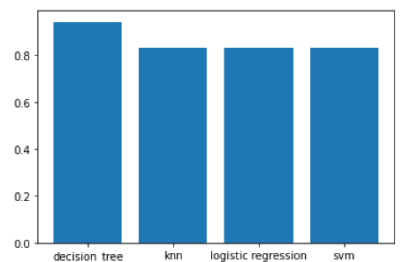

# Data Science for Launching Rockets

This is the capstone project I had to develop in order to get approved in the IBM Data Science Professional Certificate.
It consists of predictive analysis in order to predict whether a rocket will land succesfully or not. 
The analysis is done by using Python programming language, and combines great technologies such as SQL, API's and IBM Cloud resources.

You can read the final presentation [here](https://github.com/viniciuscva/capstone_project_winning_space_race_with_data_science/blob/main/final_presentation_ibm_data_science_Carlos_Vinicius.pdf).

The predictive analysis was done with four different classifiers: KNN, Decision Trees, SVM, and Logistic Regression. For this project, the Decision Tree classifier gave the best performance (88,89% accuracy).

